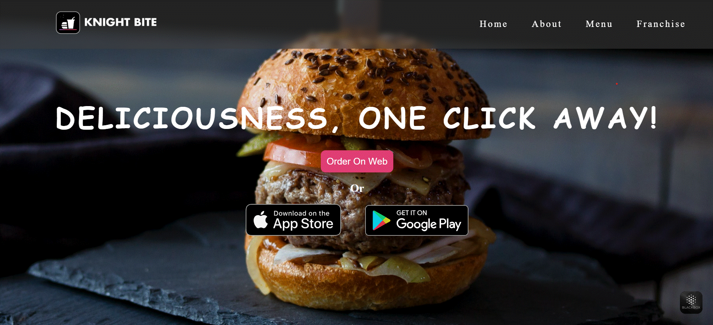
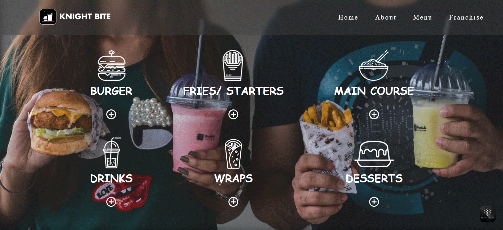

---

# 🍔 Knight Bite Website Clone


A **clone of the Knight Bite website** built using **HTML, CSS, and JavaScript**.
This project replicates the official **Knight Bite website** design with a **responsive UI** across devices.

🔗 **[Live Demo Here](https://rakshanshetty1339.github.io/Knight_bite_Website_Clone/)**

---

## 🚀 Features

* 📱 **Responsive Design** – Mobile & Desktop
* 🎨 **Modern UI/UX** – Styled with CSS
* 📂 **Multi-page Website** – Home, About, Menu, Franchise, Contact
* ⚡ **Lightweight** – No frameworks, pure HTML/CSS/JS

---

## 🛠️ Tech Stack

* **Frontend**: HTML, CSS, JavaScript
* **Deployment**: GitHub Pages
* **Tools Used**: VS Code, Git, GitHub

---

## 📸 Screenshots

*Homepage Example:*


*Menu Page Example:*


---

## 📂 Project Structure

```bash
Knight-Bite-Clone/
│── index.html
│── About.html
│── Menu.html
│── Franchise.html
│── Contact.html
│── /CSS
│   └── style.css
│── /images
│── /js
│   └── script.js
└── README.md
```

---

## ⚙️ Installation & Usage

1. Clone the repo

   ```bash
   git clone https://github.com/Rakshanshetty1339/Knight_bite_Website_Clone.git
2. Open the project folder
3. Run `index.html` in your browser

---

## 💡 Future Enhancements

* 🛒 Shopping cart functionality
* 🔑 Login & signup system
* ☁️ Backend integration
* 🌙 Dark mode

---

## 🤝 Contributing

Contributions, issues, and feature requests are welcome!
Feel free to fork this repo and submit a pull request.

---

## 📜 License

This project is created for **Educational purposes only** and is not affiliated with Knight Bite.

---
